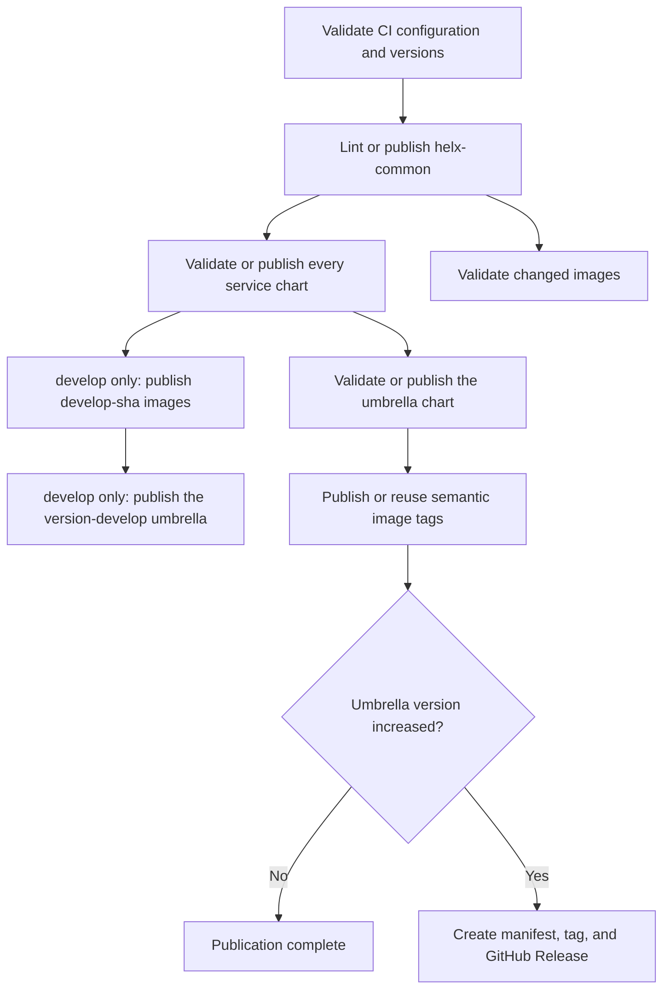

# HeLx CI/CD

The repository uses three GitHub Actions workflows:

- [`workflows/ci.yml`](workflows/ci.yml) validates pull requests and manual
  image builds without registry credentials. Nothing it produces leaves the
  runner.
- [`workflows/develop.yml`](workflows/develop.yml) validates pushes to
  `develop`, then publishes the mutable `develop` candidate channel.
- [`workflows/publish.yml`](workflows/publish.yml) serializes publication from
  `main`, reconciles immutable artifacts, and optionally creates a release.

The workflows deliberately show the publication order in YAML. Custom code is
limited to metadata validation, matrix generation, release-manifest generation,
and Helm dependency assembly that cannot be expressed safely in workflow YAML.

## Workflow order



`helx-common` is always processed first. If it cannot be built, linted, or
published, no service chart, umbrella chart, image, or release proceeds. This is
intentional because services' chart will consume the shared library from the OCI
registry.

## CI validation

`CI` runs on every pull request and on manual dispatch. Its stable
branch-protection result is `CI gate`. Pushes to `develop` are handled by
`Develop channel`, which repeats the same validation before publishing anything,
so the two do not build the same images twice.

It performs these checks:

1. install the pinned CI dependency from [`requirements-ci.txt`](requirements-ci.txt);
2. run the focused tests for [`scripts/ci.py`](scripts/ci.py);
3. validate every chart, lockfile, image definition, Dockerfile, and local
   dependency path;
4. require service chart `version` increases when a changed file would land in the
   chart's package;
5. require `appVersion` increases when a changed file would reach an image's
   build context;
6. run `actionlint` against the workflows;
7. lint and package `deploy/helm/helx-common/chart`;
8. lint and package every discovered `services/*/chart`;
9. lint and package `deploy/helm/helx-chart`; and
10. build only affected images without logging in or pushing.

All charts are validated instead of maintaining a changed-chart dependency
planner. The repository currently has few enough charts that the simpler,
predictable behavior is preferable to optimizing individual lint jobs.

Version increases in service charts are required on **every** pull request, not only 
those targeting `main`, and again on direct pushes to `develop` and `main`. The
`develop` candidate channel vendors service charts straight out of the tree, so a
chart edited without a version bump would otherwise ship under a version already
published with different content. Manual validation runs have no base revision to
compare against and are exempt.

The umbrella chart is judged differently. It is published immutably only from
`main`, so on a pull request into any other branch, and on direct pushes to
`develop`, `--umbrella-above-release` applies: rather than having to increase on
every change, its version need only sit **above the last published release**, and
may not regress against the base. Its dependency pins are still enforced.

The practical effect is one version decision per release cycle instead of one per
pull request, made by the person who knows whether their change is a patch, a
minor, or a major:

```text
released 4.6.2      -> develop still at 4.6.2, next pull request must raise it
pull request picks 4.6.3  -> merges, candidates publish to 4.6.3-develop
next pull request, no change -> merges, still 4.6.3-develop
pull request picks 4.7.0   -> merges, candidates publish to 4.7.0-develop
next pull request, no change -> merges, still 4.7.0-develop
pull request into main at 4.7.0 -> releases 4.7.0
```

Nothing implements those channels. The candidate tag is derived from the umbrella
version, so raising it to 4.7.0 simply starts publishing `4.7.0-develop`. Older
channels such as `4.6.3-develop` stop being written to and become abandoned; use
`make ci-candidate-version` to learn which one is current.

Because develop always sits above the last release, `<version>-develop` is an
honest preview of `<version>` and correctly sorts below it. "Last released" is
resolved from the `v*` tags publication creates; before the first release there is
nothing to sit above, so the umbrella is unconstrained.

The required increase reappears on the pull request into `main`, where
publication would otherwise fail the immutability preflight.

### What counts as a change

A version bump is only demanded when a changed file can actually affect the
artifact, and each artifact's own ignore file is the authority on that:

- **Charts** consult the chart's `.helmignore`. Editing `.gitignore` cannot
  change a package, so it never gates; editing `Chart.yaml`, `Chart.lock`,
  `values.yaml`, `templates/`, or the `.helmignore` itself does. Every chart
  must carry a `.helmignore` containing the baseline patterns in
  `REQUIRED_HELMIGNORE`, and it must not exclude `Chart.yaml`, `values.yaml`, or
  `templates/`; `validate-config` enforces both.
- **Images** consult `excludes` in [`ci/images.yaml`](ci/images.yaml) and the
  build context's `.dockerignore`. A path Docker never receives cannot change
  the image. Only the pattern subset used here is supported, so `validate-config`
  rejects `!` negation and `**` rather than mismatching them silently.

Both matchers follow Go's `filepath.Match`, which Helm and Docker use: `*` and
`?` never cross a path separator.

The practical consequence is that the fix for a spurious version bump is usually
to correct the ignore file, not to add a CI exception. If a README never reaches
an image, add it to that service's `.dockerignore`.

Manual dispatch accepts one image target or `all`. The target is validated against
the normalized image inventory generated from [`ci/images.yaml`](ci/images.yaml);
there are no per-service workflows or shell `case` mappings.

## Helm charts

### Layout

CI discovers:

```text
deploy/helm/helx-common/chart   shared library, always first
deploy/helm/helx-chart          umbrella, always last
services/*/chart                service charts
```

Adding a service chart under that layout automatically adds it to validation and
publication.

### Dependency rules

- A chart with dependencies must commit `Chart.lock`.
- `Chart.yaml` and `Chart.lock` must contain identical dependency
  name/version/repository tuples.
- A dependency whose name matches a chart in this repository must be pinned to
  exactly that chart's version. This is the rule that keeps the tree and the
  umbrella honest: without it, bumping a service chart and forgetting the
  umbrella pin silently drops the change from the umbrella while CI stays green.
  Bump the service chart and the umbrella pin in the same change.
- Every dependency is pinned to an exact version, so `Chart.lock` needs no
  resolution and is derivable from `Chart.yaml` with no registry access.
  Regenerate it with `make sync-locks` (every chart) or `make sync-helx-lock`
  (umbrella only) rather than `helm dependency update`; `make check-locks`
  verifies without writing. Because no resolution is involved, this also works
  for a dependency version that is not published yet, which `helm dependency
  update` cannot do. The digest reproduces Helm's `resolver.HashReq`.
- Repository-owned dependencies should use
  `oci://ghcr.io/helxplatform/helm-charts` in committed metadata.
- Generated `charts/` directories and dependency archives are not committed.
- CI assembles the exact lock locally: if a repository chart with the locked
  name and version is present, CI packages that source; otherwise it pulls the
  locked external or OCI artifact.

The exact-version local substitution is what allows a pull request to validate a
new `helx-common` or service version before it exists in GHCR. It does not change
committed dependency metadata and never substitutes a different local version.
The one exception is the `develop` candidate channel, which matches local charts
by name alone; see [Develop candidate channel](#develop-candidate-channel).
If no exact local chart exists, validation authenticates to GHCR with the job
`GITHUB_TOKEN` and pulls the version recorded in `Chart.lock`. `publish: false`
prevents a push; it does not disable dependency resolution.

### Publication

Every `main` publication reconciles all charts rather than selecting changed
charts from Git history:

1. publish or reuse `helx-common`;
2. publish or reuse every service chart, with bounded parallelism; and
3. publish or reuse the umbrella chart.

Chart versions are immutable. [`scripts/helm-preflight.sh`](scripts/helm-preflight.sh)
normalizes local and existing packages, including nested dependency archives.
An identical version is reused; different content under an existing version
fails and requires a `Chart.yaml` version increase.

Charts publish to:

```text
oci://ghcr.io/helxplatform/helm-charts
```

Validation grants the job-scoped `GITHUB_TOKEN` `packages: read` for locked OCI
dependencies. Publication chart jobs elevate that permission to
`packages: write`. Personal package access is not inherited by `GITHUB_TOKEN`:
it represents the workflow repository, not the person who triggered the run.

## Develop candidate channel

Every push to `develop` republishes one deployable candidate of the umbrella:

```text
oci://ghcr.io/helxplatform/helm-charts/helx:<umbrella-version>-develop
```

The tag is a SemVer prerelease, so it always sorts below the matching release and
cannot be mistaken for one. It is deliberately **mutable**: each push overwrites
it, and the immutability preflight is skipped for candidates only.

Three things differ from a release build, all driven by `CHART_CHANNEL` and
`CHART_CHANNEL_COMMIT` in [`scripts/helm-build-chart.sh`](scripts/helm-build-chart.sh):

1. local charts are matched by **name alone**, ignoring the locked version, so
   the archive describes the branch tree rather than what is already published;
2. the package is versioned via `helm package --version`, leaving `Chart.yaml`
   untouched; and
3. candidate image tags are merged into the umbrella's `values.yaml` before
   packaging and restored afterwards, because `helm package` accepts no value
   overrides.

Candidate mode applies only to the umbrella chart and refuses any other chart
directory. Images publish before the chart that pins them, so a cancelled run
leaves the channel behind rather than pointing at an image that was never built.

Images for a candidate are immutable and pinned to the exact commit:

```text
containers.renci.org/helxplatform/<repository>:develop-<short-sha>
```

Every image is rebuilt on every `develop` push, because the candidate pins one
shared tag that must resolve for every dependency image. A mutable channel tag
paired with immutable image references is what keeps `IfNotPresent` from serving
a stale layer.

Its stable branch-protection result is `Develop channel gate`.

## Container images

[`ci/images.yaml`](ci/images.yaml) is the only image-build inventory. It lists
image-bearing services and exceptional variants; the planner expands each entry
using the documented service defaults into source paths, chart ownership,
contexts, Dockerfiles, and Harbor repositories for:

The mapping intentionally contains only services that produce container images;
chart-only services remain covered by generic Helm chart discovery.

- appstore;
- appstore-prepuller;
- appstore-sockets server and monitoring;
- ldap-sync;
- UI; and
- user-mutator.

Pull requests build affected images with the GitHub Actions cache and no Harbor
credentials. Chart-only changes are excluded from image-source detection. When
no image sources changed, the matrix runs one clearly labeled no-op job so the
workflow remains successful without showing an unresolved matrix expression.

Each image records the values key that carries its tag, defaulting to
`image.tag`. Set `tag_path` in `ci/images.yaml` when a chart reads something else
— `appstore-prepuller` uses `controller.image.tag` and the `appstore-sockets`
monitoring variant uses `monitoring.image.tag`. `validate-config` requires the
configured path to be declared in the chart's `values.yaml`, because a path the
chart does not read would make candidate image pins silently ineffective.

On `main`, publication reconciles every configured semantic image reference:

```text
containers.renci.org/helxplatform/<repository>:v<chart-appVersion>
```

[`actions/build-service/action.yml`](actions/build-service/action.yml) first
inspects the semantic reference. An existing immutable tag is reused; a missing
tag is built and pushed directly with provenance and SBOM attestations. There
are no staging tags, promotion jobs, or digest artifacts passed between jobs.
Harbor must enforce immutability for semantic `v*` tags.

Every image-bearing service is currently a locked umbrella dependency, so all of
them appear in compatibility releases. A service that is validated and published
without being locked as a dependency is excluded from the release manifest.

## Releases

The version in `deploy/helm/helx-chart/Chart.yaml` is the authoritative HeLx
release version. A normal `main` push creates a release only when that value
increases. Documentation, CI-only, and independent component changes do not
consume release versions.

The release tag is `v<umbrella-version>`. It is annotated with a concise message
and must either be absent or already point to the same commit. The full
compatibility data is attached to the GitHub Release as
`helx-release-manifest.json`; it is not duplicated inside the Git tag.

The manifest is derived from:

- the umbrella chart name and version;
- the exact dependency tuples and digest in the umbrella `Chart.lock`;
- metadata read from the exact packaged dependency archives; and
- registry digests resolved from semantic image tags for locked dependencies.

It therefore records the umbrella's deployable dependency set, not every latest
chart in the checkout.

Manual `Publish` dispatch can set `release-current` to repair or create the
release for the current umbrella version. It cannot supply an arbitrary version.
If the tag exists at another commit, publication fails rather than moving it.

Moving the umbrella chart into its current path does not itself create a
release. Make the next release explicit by increasing its chart version.

## Repository configuration

Define these repository-level GitHub Actions secrets for Harbor:

```text
CONTAINERHUB_USERNAME
CONTAINERHUB_PASSWORD
```

GitHub Actions must be allowed to grant:

- `packages: write` to chart publication jobs; and
- `contents: write` to the optional release job.

Protect `main` and `develop` with pull requests, current-branch requirements,
restricted force pushes/deletions, and the `CI gate` required check. `Develop
channel gate` is the equivalent result for pushes that land on `develop`. Protect `.github/**` with a certain user list once the CI maintainers are
known. Publication uses one `publish-main` concurrency group and does not cancel a
running publication. GitHub Actions may replace an older pending run with a
newer one; this is safe because every run reconciles the complete immutable
chart and image inventory.

## Adding a chart or image

For a chart:

1. place service chart code under `services/<name>/chart`;
2. commit a `.helmignore` carrying the baseline patterns; the version gate reads
   it to decide what counts as a change;
3. use strict `x.y.z` chart versions;
4. commit `Chart.lock` whenever dependencies are declared; and
5. add a values override under `helm/lint-values/<chart-name>.yaml` only when
   default values cannot be linted safely.

For an image:

1. follow the conventional service layout described in
   [`ci/images.yaml`](ci/images.yaml) whenever possible;
2. add the service to the `services` mapping in `ci/images.yaml`, using only
   overrides for non-standard paths, repositories, or image variants;
3. ensure the chart defines strict `x.y.z` `appVersion` metadata;
4. exclude chart-only files from the Docker build context; and
5. set `tag_path` if the chart reads a tag key other than `image.tag`; and
6. make the image a locked umbrella dependency if it belongs in compatibility
   releases.

A service with an `images` mapping creates multiple image targets from one
chart. This is the intended way to represent services such as
`appstore-sockets`; it does not need a separate workflow. No new workflow is
required.

## Local checks

Install the one Python dependency and run focused checks:

```bash
python3 -m pip install -r .github/requirements-ci.txt
make ci-tests
make ci-validate-everything
make ci-check-versions BASE=origin/develop
make check-locks
bash -n .github/scripts/helm-build-chart.sh .github/scripts/helm-preflight.sh
make ci-build-common-chart
make ci-build-helx-chart
git diff --check
```

These wrap `.github/scripts/ci.py` and run it through the project virtualenv, so
they work without activating anything. Invoking `python3 .github/scripts/ci.py`
directly uses your system interpreter, which usually has no PyYAML; use
`.venv/bin/python` or activate the venv if you prefer calling it by hand. See the
DevEx section of the [root README](../README.md) for the full developer workflow.

`check-versions` compares committed revisions by default, which is what CI does
and what publication acts on. Pass `--include-untracked` for local runs: it
compares the working tree and adds untracked files, so a check that passes
locally does not then fail in CI once you commit. Creating a chart file such as
`.helmignore` is the usual way to hit that, because it is packaged into the chart
and therefore requires a version bump.

Workflow YAML is linted by `actionlint` in CI, not locally: `self-test` downloads
the pinned 1.7.12 release, verifies its checksum, and runs it over
`.github/workflows/*.yml`. There is deliberately no local target for it, because
workflow files change rarely and CI already gates them on every pull request and
every push to `develop`.

If you are editing workflows and want the faster loop, install it yourself and
match the pinned version so a local pass means the same thing as a CI pass:

```bash
brew install actionlint     # then check the version matches 1.7.12
actionlint .github/workflows/*.yml
```
