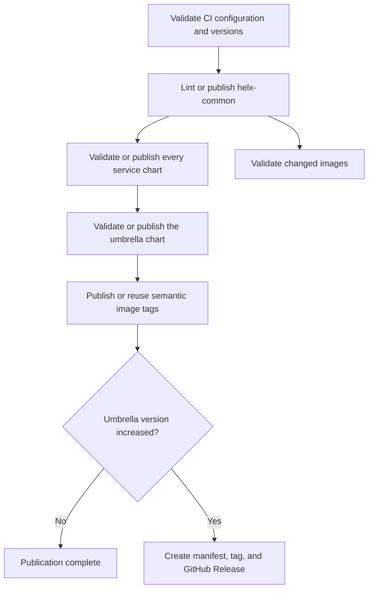

# HeLx CI/CD

The repository uses two GitHub Actions workflows:

- [`workflows/ci.yml`](workflows/ci.yml) validates pull requests, non-`main`
  pushes, and manual image builds without registry credentials.
- [`workflows/publish.yml`](workflows/publish.yml) serializes publication from
  `main`, reconciles immutable artifacts, and optionally creates a release.

The workflows deliberately show the publication order in YAML. Custom code is
limited to metadata validation, matrix generation, release-manifest generation,
and Helm dependency assembly that cannot be expressed safely in workflow YAML.

## Workflow order



`helx-common` is always processed first. If it cannot be built, linted, or
published, no service chart, umbrella chart, image, or release proceeds. This is
intentional because services' chart will consume the shared library from the OCI
registry.

## CI validation

`CI` runs on every pull request, pushes to `develop`, and manual dispatch. Pull
request runs validate proposed merges, while the `develop` push run confirms the
actual integration-branch tip. Its stable branch-protection result is `CI gate`.

It performs these checks:

1. install the pinned CI dependency from [`requirements-ci.txt`](requirements-ci.txt);
2. run the focused tests for [`scripts/ci.py`](scripts/ci.py);
3. validate every chart, lockfile, image definition, Dockerfile, and local
   dependency path;
4. for pull requests targeting `main`, require chart `version` increases when an
   existing chart directory changes;
5. for pull requests targeting `main`, require `appVersion` increases when an
   image's source changes;
6. run `actionlint` against the workflows;
7. lint and package `deploy/helm/helx-common/chart`;
8. lint and package every discovered `services/*/chart`;
9. lint and package `deploy/helm/helx-chart`; and
10. build only affected images without logging in or pushing.

All charts are validated instead of maintaining a changed-chart dependency
planner. The repository currently has few enough charts that the simpler,
predictable behavior is preferable to optimizing individual lint jobs.

Version increases are a publication-boundary policy, so they are not required on
pull requests into `develop`, `develop` push runs, or manual validation runs.
They are required before merging into the default `main` branch and are checked
again by the `Publish` workflow as a defensive measure. Changing a pull request's base
branch emits a new `edited` run with the current base; rerunning an older workflow
instead reuses that run's original commit and event payload.

Manual dispatch accepts one image target or `all`. The target list and all
build metadata come from [`ci/images.json`](ci/images.json); there are no
per-service workflows or shell `case` mappings.

## Helm charts

### Layout

CI discovers:

```text
deploy/helm/helx-common/chart   shared library, always first
deploy/helm/helx-chart          umbrella, always last
services/*/chart                service charts
```

Adding a service chart under that layout automatically adds it to validation and
publication.

### Dependency rules

- A chart with dependencies must commit `Chart.lock`.
- `Chart.yaml` and `Chart.lock` must contain identical dependency
  name/version/repository tuples.
- Repository-owned dependencies should use
  `oci://ghcr.io/helxplatform/helm-charts` in committed metadata.
- Generated `charts/` directories and dependency archives are not committed.
- CI assembles the exact lock locally: if a repository chart with the locked
  name and version is present, CI packages that source; otherwise it pulls the
  locked external or OCI artifact.

The exact-version local substitution is what allows a pull request to validate a
new `helx-common` or service version before it exists in GHCR. It does not change
committed dependency metadata and never substitutes a different local version.
If no exact local chart exists, validation authenticates to GHCR with the job
`GITHUB_TOKEN` and pulls the version recorded in `Chart.lock`. `publish: false`
prevents a push; it does not disable dependency resolution.

### Publication

Every `main` publication reconciles all charts rather than selecting changed
charts from Git history:

1. publish or reuse `helx-common`;
2. publish or reuse every service chart, with bounded parallelism; and
3. publish or reuse the umbrella chart.

Chart versions are immutable. [`scripts/helm-preflight.sh`](scripts/helm-preflight.sh)
normalizes local and existing packages, including nested dependency archives.
An identical version is reused; different content under an existing version
fails and requires a `Chart.yaml` version increase.

Charts publish to:

```text
oci://ghcr.io/helxplatform/helm-charts
```

Validation grants the job-scoped `GITHUB_TOKEN` `packages: read` for locked OCI
dependencies. Publication chart jobs elevate that permission to
`packages: write`. Personal package access is not inherited by `GITHUB_TOKEN`:
it represents the workflow repository, not the person who triggered the run.

## Container images

[`ci/images.json`](ci/images.json) is the only image-build inventory. It records
source paths, chart ownership, contexts, Dockerfiles, and Harbor repositories
for:

- appstore;
- appstore-prepuller;
- appstore-sockets server and monitoring;
- UI; and
- user-mutator.

Pull requests build affected images with the GitHub Actions cache and no Harbor
credentials. Chart-only changes are excluded from image-source detection. When
no image sources changed, the matrix runs one clearly labeled no-op job so the
workflow remains successful without showing an unresolved matrix expression.

On `main`, publication reconciles every configured semantic image reference:

```text
containers.renci.org/helxplatform/<repository>:v<chart-appVersion>
```

[`actions/build-service/action.yml`](actions/build-service/action.yml) first
inspects the semantic reference. An existing immutable tag is reused; a missing
tag is built and pushed directly with provenance and SBOM attestations. There
are no staging tags, promotion jobs, or digest artifacts passed between jobs.
Harbor must enforce immutability for semantic `v*` tags.

`appstore-prepuller` and `user-mutator` are still validated and published, but
they are not included in a compatibility release until the umbrella chart locks
them as dependencies.

## Releases

The version in `deploy/helm/helx-chart/Chart.yaml` is the authoritative HeLx
release version. A normal `main` push creates a release only when that value
increases. Documentation, CI-only, and independent component changes do not
consume release versions.

The release tag is `v<umbrella-version>`. It is annotated with a concise message
and must either be absent or already point to the same commit. The full
compatibility data is attached to the GitHub Release as
`helx-release-manifest.json`; it is not duplicated inside the Git tag.

The manifest is derived from:

- the umbrella chart name and version;
- the exact dependency tuples and digest in the umbrella `Chart.lock`;
- metadata read from the exact packaged dependency archives; and
- registry digests resolved from semantic image tags for locked dependencies.

It therefore records the umbrella's deployable dependency set, not every latest
chart in the checkout.

Manual `Publish` dispatch can set `release-current` to repair or create the
release for the current umbrella version. It cannot supply an arbitrary version.
If the tag exists at another commit, publication fails rather than moving it.

Moving the umbrella chart into its current path does not itself create a
release. Make the next release explicit by increasing its chart version.

## Repository configuration

Define these repository-level GitHub Actions secrets for Harbor:

```text
CONTAINERHUB_USERNAME
CONTAINERHUB_PASSWORD
```

GitHub Actions must be allowed to grant:

- `packages: write` to chart publication jobs; and
- `contents: write` to the optional release job.

Protect `main` and other integration branches with pull requests, current-branch
requirements, restricted force pushes/deletions, and the `CI gate` required
check. Protect `.github/**` with a certain user list once the CI maintainers are
known. Publication uses one `publish-main` concurrency group and does not cancel a
running publication. GitHub Actions may replace an older pending run with a
newer one; this is safe because every run reconciles the complete immutable
chart and image inventory.

## Adding a chart or image

For a chart:

1. place service chart code under `services/<name>/chart`;
2. use strict `x.y.z` chart versions;
3. commit `Chart.lock` whenever dependencies are declared; and
4. add a values override under `helm/lint-values/<chart-name>.yaml` only when
   default values cannot be linted safely.

For an image:

1. add its chart, source paths, context, Dockerfile, and relative Harbor
   repository to `ci/images.json`;
2. ensure the chart defines strict `x.y.z` `appVersion` metadata;
3. exclude chart-only files from both the CI source definition and Docker build
   context; and
4. make the image a locked umbrella dependency if it belongs in compatibility
   releases.

No new workflow is required.

## Local checks

Install the one Python dependency and run focused checks:

```bash
python3 -m pip install -r .github/requirements-ci.txt
python3 -m unittest discover -s .github/scripts -p 'test_*.py'
python3 .github/scripts/ci.py validate-config
python3 .github/scripts/ci.py check-versions --base HEAD^
bash -n .github/scripts/helm-build-chart.sh .github/scripts/helm-preflight.sh
bash .github/scripts/helm-build-chart.sh deploy/helm/helx-common/chart
bash .github/scripts/helm-build-chart.sh deploy/helm/helx-chart
git diff --check
```

Run `actionlint` 1.7.12 or newer for workflow validation. The workflow pins the
official 1.7.12 Linux archive checksum.
